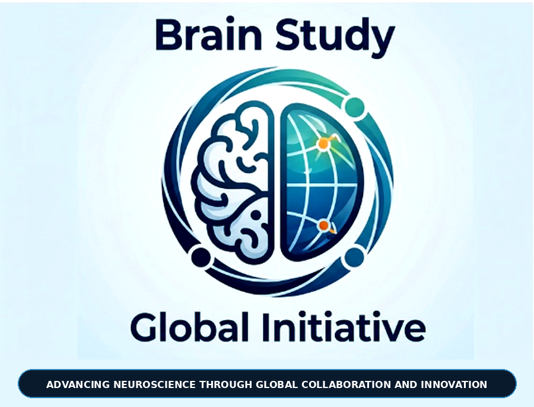

  

# Brain Study Global Initiative 🧠🌐
### Advancing Neuroscience Through Global Collaboration and Innovation

---

### 👨‍⚕️ Executive Leadership
* **Robson Orso** — Founder & Chief Executive Officer (CEO)  
* *Medical Student | Aspiring Neurosurgeon*  
* **Focus:** Neuro-oncology, 3D Neuroimaging Volumetrics, Distal Mechanical Thrombectomy & Quantitative Evidence Synthesis.

---

### 🔬 Clinical Evidence & Reproducible Pipelines
Este repositório reúne pipelines quantitativos e morfométricos abertos para pesquisa neurocirúrgica e neurovascular.

* **Pipeline R:** `ventricular_volume_analysis.R`
* **Morfometria 3D:** Segmentação volumétrica via 3D Slicer / formato NRRD
* **Diretrizes:** PRISMA 2020, Cochrane RoB 2, AMSTAR-2
